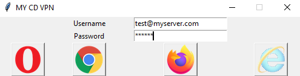

# python-ssh-SOCKS5-proxy-webDriver
Python script to initialize SSH connection with a dynamic port forwarding on port 19999 and have browsers go through local SOCKSv5 proxy.

## Execution Process:
1. Read name@server and password 
2. Create SSH connection using the given parameters 
3. Open a "dummy" browser and set a local proxy to localhost:19999 (SOCKSv5) 

### Creating SSH Connection and Checking for existing connection
The program initialy creates a SSH connection with dynamic port forwarding on local port 19999. The connection does **NOT**
allow for commands to be executed once you are logged on the remote Server. Plink is used to create the connection and also pass the
password when required.
> plink.exe -batch -ssh **usr_srv** -P 22 -D 19999 -pw **passwd** -C -N

You ca find the above command in the **runSSH()** function.
The **checkSSH()** function creates a socket and performs a request and a responce communication over the ssh connection. If the connection
exists and the function recieves a responce, it will display the data from the responce.

### WebDriver and Browser control
Each browser (Opera, Google Chrome, Firefox) has its own **prepareBrowser()** function, which creates the WebDriver
and sets the necessary settings, like --proxy 'localhost' --port '19999' etc.

